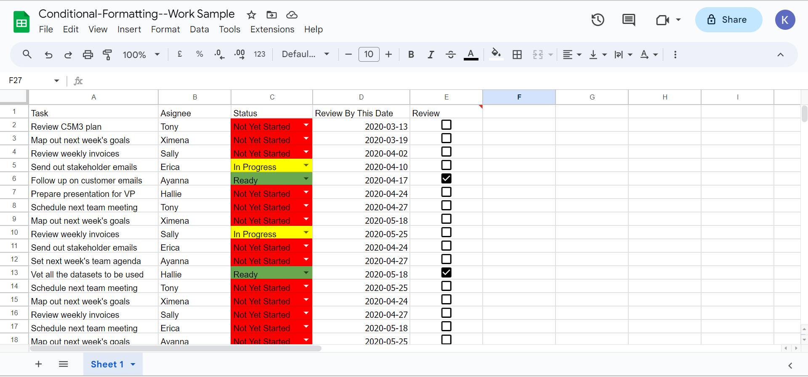

# Data Validation in Google Spreadsheets

 
<h4 align="center">Data Validation in Spreadsheets</h4>

## 🚀 Project Overview

Welcome to my GitHub repository, where I showcase my expertise in data analysis by implementing advanced data validation in Google Spreadsheets. In this project, I've revolutionized a typical spreadsheet, turning it into a dynamic and visually appealing tool for managing and monitoring tasks, projects, or any workflow.

## ✨ Key Features

- **Data Validation:** Seamlessly validate data entries with interactive checkboxes for "Approved" and "Not Approved."

- **Progress Tracking:** Enhance decision-making with a comprehensive task status system using dropdown menus with options like "Not Yet Started," "In Progress," and "Ready."

- **Visual Clarity:** Empower your team with intuitive conditional formatting that vividly represents task status changes.

This project is perfect for collaborative teams and individuals who seek an effective solution for tracking and managing tasks while leveraging the power of Google Sheets.

## 🙌 Contributing

I welcome contributions! If you have ideas for improvements or encounter any issues, please:

- Open an issue to initiate a discussion.

- Submit a pull request to actively contribute to the project's growth.
